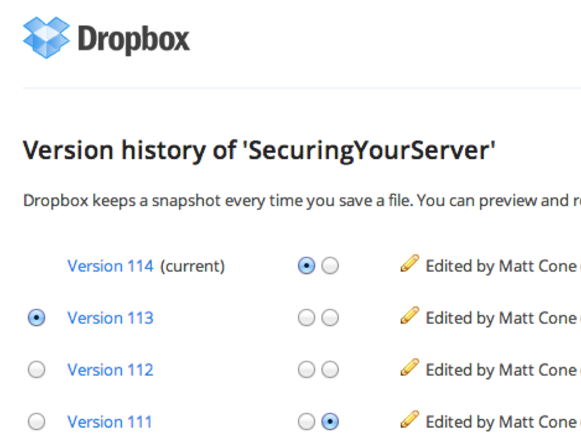

Version Control
========================================================
author: 
date: 
autosize: true

An artistic approach to version control
========================================================
<br>
`
MyAnalysis_01.R
MyAnalysis_02.R
MyAnalysis_03.R
MyAnalysis_04_withCharts.R
MyAnalysis_05_withCharts.R
`
***



Version control with Git + GitHub
========================================================


4 good reasons for using Git + GitHub
========================================================


3 more reasons for setting up Git + GitHub ASAP
========================================================

- You will use GitHub to submit the assignments and the project
- You will 'pull' (i.e., download) the course material from GitHub


A commit is a snapshot of your repository
========================================================

Definition of a commit

Define master repository


Navigating commits - retrieving past commits
========================================================

add picture with animation

Navigating commits - branching
========================================================

add picture with animation

Navigating commits - exercise
========================================================

Inside of the dashed squared are the files that you commit. Anything outside of the dashed line is simply saved at each step. A color change means that the file has been edited (and saved).

Is there a way to retrieve the red square from stage 3 once you commit stage 4?


Push your commit to GitHub from RStudio
========================================================

To sync your local commits in Git with GitHub, 
 to your remote repo.

You can to the same from the terminal. 

Type `git push origin master` and press **Enter** to push from your master to the remote GitHub origin (` https://github.com/YourName/courseRepo`)

```
$git push origin master
```


Clone from Github
========================================================

We will learn how to 'clone' a GitHub repo while setting up a private repo for submitting your assignments.

Go to your GitHub profile and create a new repository called `assignments`. 

click clone or download 
copy URL (e.g., `https://github.com/YourName/assignments.git`)

Click File
New Project
Version Control
Git


Fork from Github
========================================================

We will learn how to 'fork' a GitHub repo while downloading the material for this class.

A fork is a copy of a repo on your GitHub space. 


It is used for:

1. Working on a copy of someone's repository. For instance, you find the code for an online scraper but you need to edit it)
2. Collaborate with someone on the same repository. For instance, you find a mistake in my code and you want to fix it. You can to that by submitting a 'pull request' to the project owner. 
The project owner receives the pull request and can merge it into his repo.
If the owner accepts your request, everyone who forked the same repo will see your new code.


Fork from Github
========================================================

Once you fork `DarioBoh/courseRepo` (the course repo), the repo `YourName/courseRepo` becomes an exact copy of `DarioBoh/courseRepo`. However, further changes in `DarioBoh/courseRepo` will not affect `YourName/courseRepo`.

You can push your notes to `YourName/courseRepo` without affecting `DarioBoh/courseRepo`. However, you will always refer to `DarioBoh/courseRepo` to pull new material for each class.

Your Git repo also will not automatically pull from `DarioBoh/courseRepo`. 


Pulling from DarioBoh/courseRepo
========================================================

To simplify pulling from `DarioBoh/courseRepo`, we need to setup a git alias called `upstream` linked to `DarioBoh/courseRepo`.

If you created your Rproject from `Version Control`, Git aliased as `origin` your GitHub repo ` `https://github.com/YourName/courseRepo.git`. When working in Git, `origin` is a remote repo. To view all the remotes:

Type `git remote -v` and press **Enter**. You'll see the current configured remote repo for your fork:

```
$ git remote -v
origin  https://github.com/YourName/courseRepo.git (fetch)
origin  https://github.com/YourName/courseRepo.git (push)
```

Add DarioBoh/courseRepo as upstream repo
========================================================

Type `git remote add upstream` then paste the URL for `DarioBoh/courseRepo` and press **Enter**. 

```{}
$ git remote add upstream https://github.com/DarioBoh/courseRepo.git
```

Now you can refer to `https://github.com/DarioBoh/courseRepo.git` by typing only `upstream` - but you could have named it anything.

By typing again `git remote -v` you shoud see `upstream` within your remotes:

```
$ git remote -v
origin  https://github.com/YourName/courseRepo.git (fetch)
origin  https://github.com/YourName/courseRepo.git (push)
upstream  https://github.com/DarioBoh/courseRepo.git (fetch)
upstream  https://github.com/DarioBoh/courseRepo.git (push)
```

Pull from DarioBoh/courseRepo 
========================================================

Type `git pull upstream master` to pull new commitments from `upstream` (my GitHub repo) to `master` (your git branch).

```
$ git pull upstream master
```

During the course, you will need this command to "download" the material I had to the `courseRepo`.


